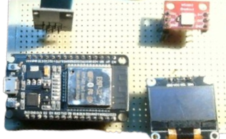

# WhatsTheWeather


**WhatsTheWeather (WTW)** is a compact weather station built around an **ESP32 DevKit C**.
   WTW Combines **Live weather data from the internet** with **Local temprature readings** from and onboard sensor. The data is displayed on an **OLED Screen**, While LEDS Provide a quick visual indication of the current weather temprature

---
## Features

* **Local Temperature Monitoring**
  Measures the temperature in your room using a DHT11 sensor.

* **Live Weather Data**
  Retrieves real-time weather information from **Open-Meteo**.

* **OLED Weather Display**
  Displays weather and sensor information on an SSD1306 OLED.

* **Wi-Fi Connectivity**
  Connects to the internet through the ESP32's built-in Wi-Fi.

* **Automatic Weather Updates**
  Periodically retrieves updated weather information.

* **Location-Based Data**
  Weather information is retrieved based on the latitude and longitude configured in the code.

* **ESP32 Powered**
  Runs entirely on an ESP32 DevKit C.

* **Independent Local Sensor**
  The onboard sensor operates independently from the online weather data, allowing you to compare local conditions with the reported weather.
---
## Hardware

* ESP32 DevKit C
* SSD1306 OLED Display
* DHT11 Temperature & Humidity Sensor
* LEDs
* 220Ω Resistor
* Perfboard
* USB Cable / Power

> **Note:** A custom PCB was not used due to time restrictions. The final hardware was assembled on perfboard instead.

## How It Works

The ESP32 connects to a Wi-Fi network and retrieves weather data from **Open-Meteo**.

At the same time, the DHT11 provides local temperature and humidity readings.

The two sets of information are displayed on separate menus on the OLED. The menus can be switched by touching a **floating wire connected to the ESP32**, which acts as a simple capacitive touch input.

The LEDs provide an additional visual indication of the current weather or temperature.

```text
             ┌────────────────┐
             │   Open-Meteo   │
             │  Weather Data  │
             └───────┬────────┘
                     │ Wi-Fi
                     ▼
┌────────────┐   ┌──────────────┐   ┌────────────┐
│   DHT11    │──▶│    ESP32     │──▶│   OLED     │
│   Sensor   │   │  DevKit C    │   │  Display   │
└────────────┘   └──────┬───────┘   └────────────┘
                        │
                        ▼
                   ┌─────────┐
                   │  LEDs   │
                   └─────────┘
```

## Getting Started

### 1. Open Your Preferred Code Editor

Open the `.ino` file provided in this repository using your preferred Arduino-compatible editor, such as **Arduino IDE**.

### 2. Install the Required Libraries

The project uses the following libraries:

* `WiFi.h`
* `HTTPClient.h`
* `ArduinoJson`
* `DHT sensor library`
* `Adafruit GFX`
* `Adafruit SSD1306`

Make sure all required libraries are installed before compiling the project.

### 3. Configure Wi-Fi

Open the `.ino` file and find the Wi-Fi configuration.

Replace the placeholders with your own Wi-Fi credentials:

```cpp
const char* WIFI_SSID = "YOUR_WIFI_NAME";
const char* WIFI_PASSWORD = "YOUR_WIFI_PASSWORD";
```

**Do not upload your real Wi-Fi credentials to a public repository.**

### 4. Configure Your Location

WTW uses **latitude and longitude** to determine which weather data to retrieve.

You can find the coordinates of your location using [Google Maps](https://maps.google.com/).

Search for your location, find its coordinates, and enter them into the corresponding latitude and longitude variables in the code.

For example:

```cpp
const float LATITUDE = 8.9127357;
const float LONGITUDE = 76.6388022;
```

### 5. Upload the Firmware

Connect your ESP32 to your computer using USB.

Select the correct **ESP32 board** and **COM port** in your development environment, then compile and upload the firmware.

Once uploaded, WTW will connect to Wi-Fi and begin displaying weather and local sensor data.

## Project Status

**Completed / Functional**

WTW is a functional ESP32 weather station combining online weather information with real-time local sensor readings.

## Built With

* **ESP32**
* **Arduino**
* **Open-Meteo**
* **SSD1306 OLED**
* **DHT11**
* **ArduinoJson**

---

### WhatsTheWeather

*Know what's happening outside. Know what's happening inside.*
